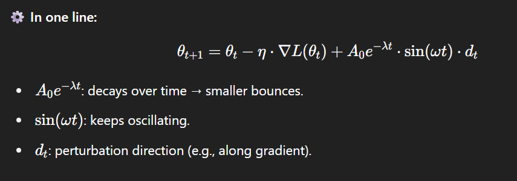

# 🏀 Bouncing Decayer Optimizer

> A physics-inspired optimizer for PyTorch adding decaying oscillations to gradient descent.

[](https://pypi.org/project/bouncing-decayer-optimizer/)
[](https://colab.research.google.com/drive/1ZC-U6TASEI6S0BpReI964XReAnaPirQT?usp=sharing)

---

## ✨ Motivation

Traditional optimizers like **gradient descent** are the backbone of AI and deep learning — including training large language models (LLMs).  
They typically move **monotonically downhill** towards a local minimum.

Inspired by physics, **Bouncing Decayer Optimizer** introduces a *decaying oscillatory perturbation*, similar to how a bouncing ball first takes large leaps, then smaller ones until it comes to rest.  
This can help exploration and potentially escape shallow local minima early in training.



*Visual intuition: we add a decaying oscillatory perturbation to each gradient step, similar to a bouncing ball slowly coming to rest.*

---

## 📦 Installation

```bash
pip install bouncing-decayer-optimizer
